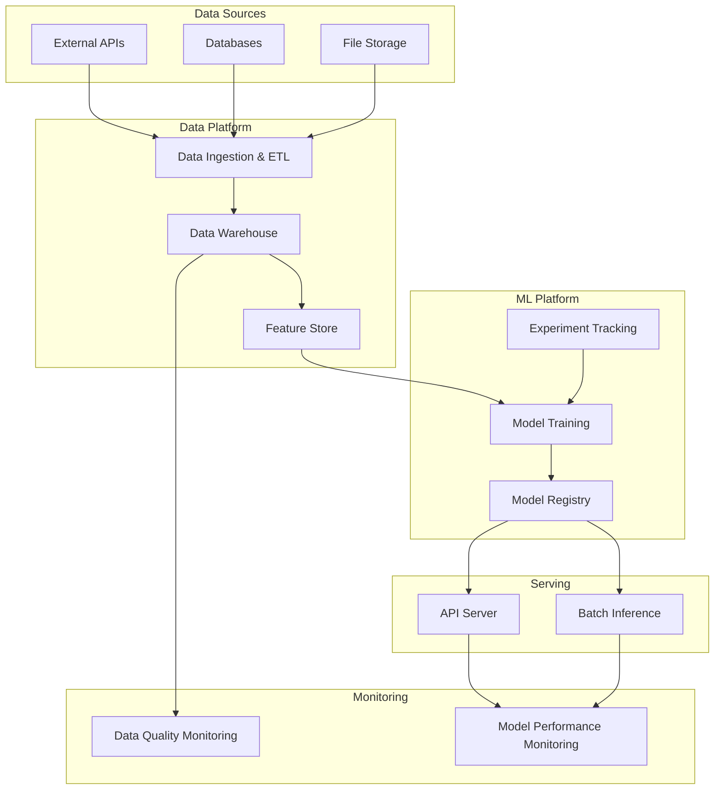

# System Overview

This document provides a high-level overview of the system architecture for a typical AI project. It is intended to be a starting point and should be adapted to fit the specific needs of your project.

## Architecture Diagram

## Components

### Data Sources

*   **External APIs:** Third-party services that provide data.
*   **Databases:** Internal databases containing business data.
*   **File Storage:** Cloud storage services like S3 or GCS for storing raw data.

### Data Platform

*   **Data Ingestion & ETL:** Pipelines for extracting, transforming, and loading data from various sources into the data warehouse.
*   **Data Warehouse:** A central repository for structured and semi-structured data.
*   **Feature Store:** A centralized repository for storing, sharing, and managing features for machine learning models.

### ML Platform

*   **Experiment Tracking:** Tools for tracking experiments, including code, data, parameters, and metrics.
*   **Model Training:** The process of training machine learning models on the prepared data.
*   **Model Registry:** A central repository for storing, versioning, and managing trained models.

### Serving

*   **API Server:** A web server that exposes the trained model as an API for real-time inference.
*   **Batch Inference:** The process of running inference on a large batch of data.

### Monitoring

*   **Data Quality Monitoring:** Tools for monitoring the quality of the data used to train and evaluate models.
*   **Model Performance Monitoring:** Tools for monitoring the performance of the model in production.
