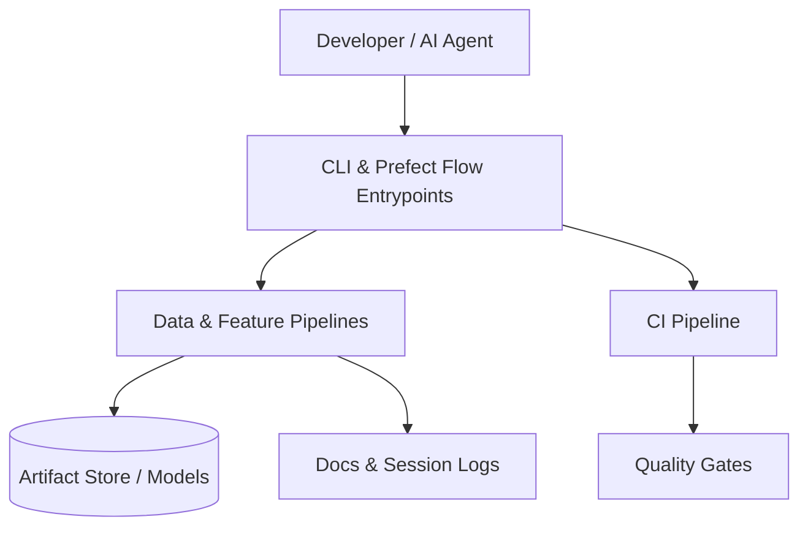

# Project Charter

This document is the single source of truth for project goals, scope, and technical context.
It should be updated as the project evolves, especially the DECISION LOG.

> 📚 For a high-level entry point and links to all documentation, see [README.md](../README.md).

## Project Overview

**Project Name:** Vibe Coding Data Science Template

**Project Vision:** Deliver a reusable, well-governed starter kit that lets data science teams launch new projects with proven automation, observability, and collaboration patterns in hours instead of weeks.

**Technical Goal:** Ship a v1.0 template release by 2026-01-31 with automated CI checks, runnable Prefect pipeline examples, and living documentation that meets the quality gates in `docs/checklists.md`.

**Repository:** https://github.com/connorkitchings/Vibe-Coding

## Users & User Stories

### Primary Persona

**Target User:** Data science tech leads responsible for bootstrapping analytics or ML projects across teams.

- **Name:** Dana Data Lead
- **Role:** Principal Data Scientist / Platform Lead
- **Pain Points:** Rebuilding boilerplate for every effort, inconsistent tooling, lack of governance for AI-assisted collaboration.
- **Goals:** Stand up new projects quickly with consistent quality bars, reuse automation, and keep human/AI contributors aligned.

### Core User Stories

As a data platform lead, I want a reusable template so that new projects begin with consistent tooling and governance.

**Story 1:** As Dana, I want to clone the template and immediately run linting/tests so that I can confirm the scaffolding works before customizing it.

- Priority: Must-have

**Story 2:** As Dana, I want example Prefect flows and docs so that I can demo the end-to-end pipeline to stakeholders within the first week.

- Priority: Should-have

## Features & Scope

**Core Features:** Production-grade repository scaffold, automated CI pipeline, sample Prefect flows, modular data/model scripts, and documentation/guardrails for blended AI + human development.

For detailed documentation on specific features, data contracts, and models, refer to the `docs/api/`, `docs/data/`, and `docs/models/` directories respectively.

### Must-Have (MVP)

**Feature A:** Hardened repository skeleton with CI, linting, and testing ready to fork.

- User Story: Story 1
- Implementation: Track in `docs/implementation_schedule.md` Week 1–2
- User Impact: High

**Feature B:** Example data pipeline (ingest → feature engineering → model baseline) orchestrated by Prefect with logging.

- User Story: Story 2
- Implementation: Track in `docs/implementation_schedule.md` Week 2–3
- User Impact: Medium

### Should-Have (Post-MVP)

**Feature C:** Optional UI/CLI showcase for template consumers to demo end-to-end flow.

- Implementation: `docs/implementation_schedule.md` Week 4 item “Prepare CLI/UI stub”

### Out of Scope

- Production deployment pipelines for domain-specific applications.
- Managing secrets or environment-specific infrastructure.
- Building bespoke models beyond the illustrative baseline packaged with the template.

## Architecture

### High-Level Summary

The template centers on a Prefect-orchestrated data workflow wrapped in reusable Python modules. Developers (human or AI) invoke CLI scripts or flows that pull data sources, transform features, and persist artifacts. Observability is provided through structured logging and CI automation, while MkDocs surfaces documentation.

### System Diagram

### Folder Structure

- `/src`: Contains the main source code for the project.
- `/docs`: Contains all project documentation, including planning, guides, and logs.
- `/notebooks`: Contains Jupyter notebooks for experimentation and analysis.
- `/data`: Contains raw, interim, and processed data (not versioned by Git).
- `/tests`: Contains all unit, integration, and functional tests.

## Technology Stack

| Category | Technology | Version | Notes |
|----------|------------|---------|-------|
| Package Management | uv | 0.4.x | High-performance Python package manager and resolver |
| Core Language | Python | 3.11 | Primary programming language |
| Linting & Formatting | Ruff | 0.5.x | Combines linting, formatting, and import sorting |
| Experiment Tracking | MLflow | 2.x | Included as optional dependency for downstream projects |
| Data Lineage | OpenLineage | 1.15+ | Enables lineage capture when pipelines are extended |
| Testing | Pytest | 8.x | Framework for writing and running tests |
| Documentation | MkDocs + Material | 1.6 / 9.x | Static site generator for project documentation |
| Orchestration | Prefect | 2.19+ | Workflow orchestration and scheduling |

## Risks & Assumptions

### Key Assumptions

**User Behavior:** We assume template adopters will customize flows and modules within 1–2 days of cloning rather than treating the repo as a static showcase.

- Validation: Gather feedback from early adopters via retro notes in `session_logs/` after onboarding.

**Technical:** We assume Prefect 2.x and uv-managed environments remain compatible across supported operating systems.

- Validation: Run example flows and CI pipeline on GitHub Actions and local macOS/Linux during Week 1–2.

### Technical Risks

| Risk | Probability | Impact | Mitigation |
|------|-------------|--------|------------|
| Template falls out of sync with Vibe Coding standards | Medium | Medium | Review quarterly against `docs/development_standards.md` and update changelog |
| CI pipeline becomes brittle due to upstream tool changes | Medium | High | Pin critical tooling versions, monitor CI failures, and document fixes in KB |
| Lack of real data sources limits usefulness of examples | Medium | Medium | Provide synthetic datasets and clear extension guides in docs |

## Decision Log

| Date       | Decision                                    | Context / Drivers                                           | Impact / Follow-up                                    |
|------------|---------------------------------------------|-------------------------------------------------------------|-------------------------------------------------------|
| YYYY-MM-DD | Example: Adopt uv-managed toolchain in prod | Align local + CI environments before first feature sprint   | Update `docs/runbook.md` and notify DevEx maintainers |

*Replace the sample row during kickoff and append new entries chronologically.*

---

*This document consolidates the project definition, technical context, and scope appendix into a
single source of truth.*
